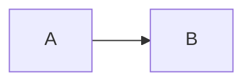

# maaz.notes

A clean Next.js 16 portfolio/blog starter for mathematics, computer science, systems notes, and vocabulary practice.

## Features

- Markdown blog posts in `content/posts/*.md`
- Markdown editor + live preview at `/studio`
- KaTeX math: `$x^2$` and `$$...$$`
- Mermaid diagrams in fenced blocks: ` ```mermaid `
- Daily deterministic set of 10 vocabulary flashcards at `/vocabulary`
- Vocabulary stored in `content/vocabulary.md`
- Local publishing writes files directly to `content/posts/`
- Vercel publishing can commit posts to GitHub through the GitHub Contents API
- No database required

## Run locally

```bash
npm install
npm run dev
```

Open http://localhost:3000.

## Vercel publishing setup

1. Put this project in a GitHub repository.
2. Import it into Vercel.
3. Add `GITHUB_TOKEN`, `GITHUB_OWNER`, `GITHUB_REPO`, and `GITHUB_BRANCH` to Vercel environment variables.
4. Give the GitHub token Contents read/write access only to this repository.
5. Redeploy.

The Studio Publish button then creates or updates `content/posts/<slug>.md`. The Git push triggers a new Vercel deployment, so the post becomes public without a database.

### Important

If `STUDIO_PASSWORD` is set, both publishing APIs require the same password in the `x-studio-password` header. The browser stores it in localStorage after the first prompt. For a larger public CMS, replace this with proper identity-based authentication.

## Content format

```md
---
title: "My title"
description: "Short description"
date: "2026-09-22"
tags: ["math", "cs"]
---

# Hello

Text with **Markdown**.

$$
E = mc^2
$$


```
